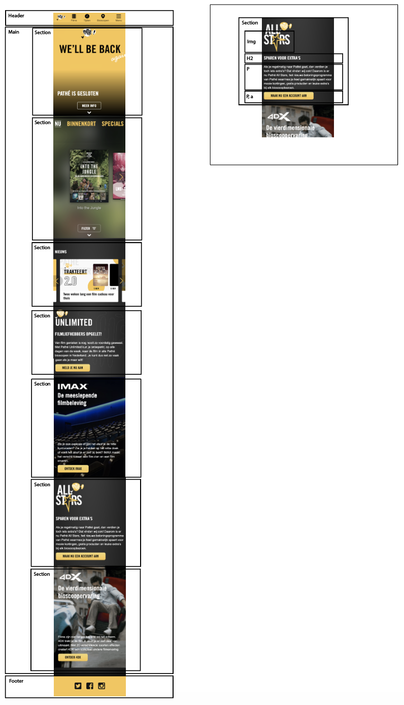
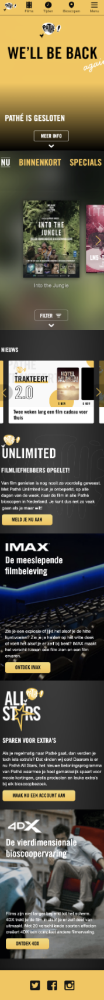
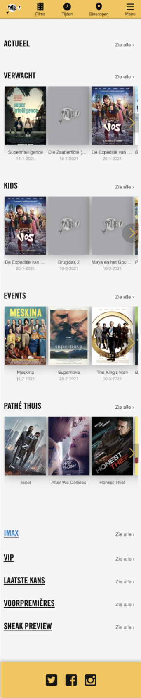

# Procesverslag
**Auteur:** -Jeroen-

Markdown cheat cheet: [Hulp bij het schrijven van Markdown](https://github.com/adam-p/markdown-here/wiki/Markdown-Cheatsheet). Nb. de standaardstructuur en de spartaanse opmaak zijn helemaal prima. Het gaat om de inhoud van je procesverslag. Besteedt de tijd voor pracht en praal aan je website.

## Bronnenlijst
1. -Bron van logo website: https://www.pathe.nl-
2. -Bron van afbeeldingen homepagina: https://www.pathe.nl -
3. -Bron van afbeeldingen pagina "Films": https://www.pathe.nl/films-
4. -Bron van hoe je een pop-up scherm kan maken: https://www.w3schools.com/howto/tryit.asp?filename=tryhow_css_modal-

## Eindgesprek (week 7/8)

-dit ging goed & dit was lastig-

**Screenshot(s):**

-screenshot(s) van je eindresultaat-

## Voortgang 3 (week 6)

### Stand van zaken

- Eindelijk gelukt om een carousel te maken, wel zonder JavaScript. JavaScript heb ik verwerkt in het pop-up scherm. Met het pop-up scherm was ik lang bezig, er zaten namelijk wat fouten in waardoor het pop-up scherm niet meer te zien was. Het was moeilijk om deze fouten te vinden, maar het is uiteindelijk wel gelukt. Verder heb ik animaties toegevoegd. De tweede pagina wil ik verder uitwerken nadat ik feedback over mijn carousel op de homepagina heb ontvangen.  -

**Screenshot(s):**

-screenshot(s) van hoe ver je bent-

### Agenda voor meeting

-samen met je groepje opstellen-

| Jeroen    | Kai          | Lisa   | Nienke        |
| ---            | ---                | ---          | ---              |
| Is mijn carousel zonder JavaScript voldoende?  |            |  |   |
| Hoe is de code tot nu toe?  |  |  |  | 
| ...            | ...                | ...          | ...              |

### Verslag van meeting

-Ik mag geen class of id gebruiken, alleen als het echt noodzakelijk is. Carousel was prima, omdat ik JavaScript ergens anders in heb verwerkt. Code is prima, los van het gebruik van class en id. Nu moet ik verder met het uitwerken van de tweede pagina. Ook moet ik de stof van 'toegankelijkheid' verwerken en het beoordelingsformulier doornemen om te kijken of alles erin zit. -

## Voortgang 2 (week 5)

### Stand van zaken

-Vond het enorm lastig om een begin te maken met de carousel. Uiteraard eerst op internet gezocht naar voorbeelden, maar dit zag er heel ingewikkeld uit. Te moeilijk voor mijn niveau op dit moment. Tijdens het voortgangsgesprek ga ik daarnaar informeren. Verder vond ik het responsive maken van mijn website moeilijker dan verwacht. Daarom heb ik besloten om me eerst enkel te richten op de surface. Het was eerst de bedoeling om beide te doen. Maar het ging/gaat voor mij dus nog wat te snel om de stof van het responsive maken van de website zonder problemen toe te passen. -

**Screenshot(s):**

-screenshot(s) van hoe ver je bent-

### Agenda voor meeting

-samen met je groepje opstellen-

| Jeroen    | Kai          | Lisa   | Nienke        |
| ---            | ---                | ---          | ---              |
| Hoe is de code tot nu toe?  | Hoeveel wordt er verwacht op de surface?            | Hoe animatie en JavaScript erin verwerken?  | Advies over CSS en JavaScript  |
| Er zit teveel ruimte tussen de footer en de main. Hoe los ik dit op? | JavaScript | Hoe navigatie werkende krijgen? | dit wil ik zeker | Hoe maak ik een begin met een carousel?
| ...            | ...                | ...          | ...              |

### Verslag van meeting

-Ik mag geen class of id gebruiken, alleen als het echt noodzakelijk is. In een section moet altijd een h1, h2 etc. aanwezig zijn.  Dit was niet altijd het geval. Wanneer er geen h1 of h2 aanwezig is, hoef/mag je geen section gebruiken. Uitleg gekregen over mijn vraag van de footer. Verder een voorbeeld gezien bij Kai van hoe je een carousel kan maken. -

## Voortgang 1 (week 3)

### Stand van zaken

-Begin maken aan de website ging wat moeizaam, omdat het al een tijdje geleden was dat ik een website had gemaakt met code. Nieuwe kennis van positioneren van onderdelen toegepast, dit ging wel goed. Had wel problemen met afbeeldingen op de achtergrond, deze namen meer ruimte in dan de breedte van de iPhone SE2. Ik wist niet hoe ik dit kon oplossen. Hier ga ik tijdens het gesprek naar informeren.   -

**Screenshot(s):**

-screenshot(s) van hoe ver je bent-

### Agenda voor meeting

-samen met je groepje opstellen-

| Jeroen      | Kai         | Nienke    | Lisa        |
| ---            | ---                | ---          | ---              |
| Hoe is de code tot nu toe?  |Verschil tussen mijn pagina en de echte             | Semantiek   | Beste aanpak navigatie    |
| Website niveau blauw?| Semantiek | Beste aanpak voor straks | Bewerking van een ul en hoe iconen in een rij krijgen?
|             | ...                | ...          | ...              |

### Verslag van meeting

-Als je class of id gebruikt is het gebruikelijk dat in het Engels te doen i.p.v. Nederlands. Uitleg over background-image in CSS gehad, zodat ik kan oplossen dat de afbeelding niet breder is dan het formaat van het scherm. Verder is mijn gekozen website te doen voor niveau blauw, dus niet nodig om een andere website te kiezen. Ook moet ik beginnen aan de tweede pagina. De HTML code tot nu toe is prima.-

## Breakdownschets (week 1)

-uitwerken voor de 1e werkgroep - eind van de eerste week-

## Intake (week 1)
-uitwerken voor de kick-off werkgroep - begin van de eerste week-

**Je startniveau:** -Blauw-

**Je focus:** -Surface-

**Je opdracht:** -https://www.pathe.nl 

**Screenshot(s) van de eerste pagina (small screen):**

**Screenshot(s) van de tweede pagina (small screen):**

